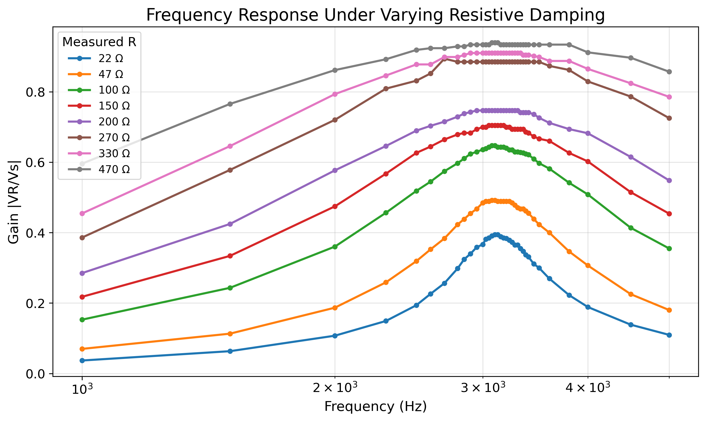
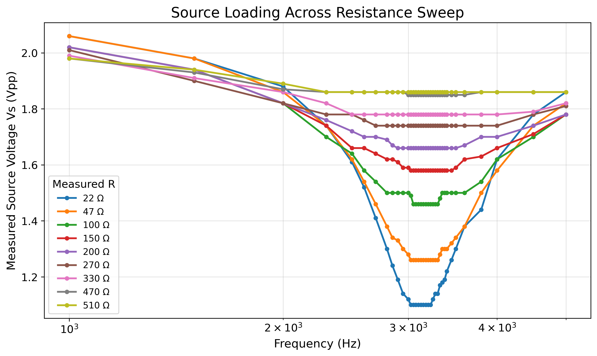

# Non-Ideal RLC System Identification

Experimental and computational investigation of parameter reconstruction, identifiability, and model mismatch in a non-ideal series RLC circuit.

---

## Overview

This project studies how hidden parameters and non-ideal behavior in a damped RLC circuit can be reconstructed from experimental frequency-response measurements.

A physical series RLC circuit was built and tested using a signal generator and oscilloscope. The measured frequency-response data are analyzed using Python to compare ideal and non-ideal models, estimate effective circuit parameters, study damping and source-loading effects, and investigate when parameter reconstruction becomes ambiguous.

The project focuses on the difference between fitting a model well and correctly identifying the physical parameters of the system. A low fitting error does not automatically mean that the recovered parameters are physically true; it only means that the model reproduces the measured response well.

This distinction is central to the project.

The project combines experimental measurements, model fitting, and inverse-problem analysis to investigate both reconstruction accuracy and parameter identifiability.

---

## Research Question

How accurately can hidden parameters of a non-ideal RLC circuit be reconstructed from frequency-response magnitude data, and when does reconstruction become ambiguous due to damping, source loading, parameter correlation, and model mismatch?

---

## Experimental System

Circuit topology:

```text
Signal Generator → Inductor → Capacitor → Resistor → Ground
```

The measured output is the voltage across the resistor.

Measured quantities:

* Frequency
* Source voltage (Vs)
* Resistor voltage (VR)
* Gain = VR / Vs

Equipment:

* FY6900 signal generator
* FNIRSI 5012H oscilloscope
* Breadboard
* Resistors
* 10 mH inductor
* 220 nF polyester capacitor

---

## Methodology

The project follows a complete experimental and computational workflow:

1. Collect frequency-response measurements across multiple resistance conditions.
2. Clean and validate the experimental data.
3. Analyze resonance behavior and source-loading effects.
4. Fit a non-ideal RLC transfer-function model to measured gain curves.
5. Estimate effective hidden resistance, inductance, and capacitance.
6. Evaluate reconstruction quality using residuals and RMSE.
7. Analyze practical identifiability using one-dimensional and two-dimensional RMSE landscapes.
8. Interpret parameter drift as evidence of model mismatch and effective-parameter behavior.

---

## Non-Ideal RLC Model

The model treats the total damping resistance as:

```text
R_total = R_measured + R_hidden
```

The fitted parameters are:

* R_hidden
* L_eff
* C_eff

These quantities are interpreted as effective parameters rather than guaranteed direct measurements of individual physical components.

---

# Results and Findings

## Experimental Characterization

The resistance sweep demonstrates that damping strongly influences the measured frequency response.

Observed behavior:

* Peak gain increases with measured resistance.
* Low-resistance configurations exhibit stronger source-loading effects.
* High-resistance curves become flatter and less sharply resonant.
* Resonance frequency remains comparatively stable while gain and bandwidth change significantly.
* Ideal RLC assumptions are insufficient because the measured source voltage is not constant.



The gain curves reveal substantial changes in resonance behavior across resistance conditions and provide the experimental foundation for all subsequent reconstruction analyses.

---

## Source Loading

One of the most significant non-ideal effects observed in the experiment is source loading.

The measured source voltage varies with both frequency and resistance, particularly for low-resistance configurations near resonance.



This behavior demonstrates that the signal generator cannot be modeled as an ideal voltage source and motivates the use of non-ideal circuit models.

---

## Parameter Reconstruction

A non-ideal RLC model was fitted to experimental gain curves.

For each resistance condition, the fitting process estimated:

* Hidden resistance
* Effective inductance
* Effective capacitance
* Reconstructed resonance frequency
* RMSE

Representative reconstructed parameters:

| Measured Resistance | R_hidden |      L_eff |      C_eff |
| ------------------: | -------: | ---------: | ---------: |
|                22 Ω | ≈ 34.5 Ω | ≈ 10.69 mH |   ≈ 242 nF |
|               150 Ω |   ≈ 62 Ω | ≈ 12.86 mH |   ≈ 201 nF |
|               470 Ω | ≈ 35.5 Ω | ≈ 10.63 mH | ≈ 235.5 nF |

The model reproduces the measured gain curves with low error across all resistance conditions.

However, the recovered parameters drift systematically across experiments despite similar reconstruction quality.

---

## Identifiability Analysis

Practical identifiability was studied using RMSE sweeps and RMSE maps.

Completed analyses include:

* One-dimensional RMSE sweeps for R_hidden, L_eff, and C_eff
* Two-dimensional RMSE maps for L_eff–C_eff
* Two-dimensional RMSE maps for R_hidden–L_eff
* Two-dimensional RMSE maps for R_hidden–C_eff
* 5% and 10% RMSE-threshold uncertainty intervals

[LC RMSE map](figures/identifiability/rmse_2d/LC_heatmap_R_150ohm.png)

Key findings:

* Parameters are practically identifiable within individual experiments.
* Uncertainty intervals are relatively small.
* The product L_eff × C_eff remains nearly constant.
* Reconstructed resonance frequency remains within approximately 2% of its mean value.
* L_eff and C_eff exhibit a strong tradeoff relationship.
* Hidden resistance likely compensates for unmodeled physical effects.

These results suggest that reconstruction is locally stable while still exhibiting parameter correlations characteristic of inverse problems.

---

## Scientific Interpretation

The parameter drift is likely caused by model mismatch.

The simplified model combines several physical effects into a small number of effective parameters. Possible unmodeled effects include:

* Source impedance
* Inductor winding resistance
* Capacitor ESR
* Breadboard parasitics
* Frequency-dependent losses
* Measurement limitations

Therefore, the reconstructed values should be interpreted as effective model parameters rather than direct measurements of the true physical component values.

This distinction motivates the use of identifiability analysis, since accurate curve fitting alone is insufficient evidence that a parameter estimate corresponds uniquely to the underlying physical system.

---

## Repository Structure

```text
data/
├── raw/                  Original experimental measurements
├── cleaned/              Validated and standardized datasets
└── processed/            Summary tables and reconstruction outputs

figures/
├── experimental/         Resistance sweeps, source loading, repeatability
├── reconstruction/       Fitted curves, residuals, parameter drift
└── identifiability/      RMSE sweeps, RMSE maps, uncertainty bounds

notebooks/                Exploratory and reproducible analyses
reports/                  Technical summaries
src/                      Reusable Python modules
scripts/                  Analysis scripts
docs/                     Theory, methodology, and supporting documentation
```

---

## Current Status

### Completed

* Experimental series RLC circuit construction
* Frequency-response measurements
* Multiple resistance sweep datasets
* Data cleaning and validation
* Repeatability analysis
* Source-loading analysis
* Non-ideal model fitting
* Parameter reconstruction
* Residual and RMSE analysis
* Practical identifiability analysis
* Uncertainty interval estimation

### In Progress

* Improved model interpretation
* Sensitivity analysis
* Source impedance modeling
* More detailed uncertainty quantification

---

## Future Work

Planned extensions include:

### Modeling

* Source impedance modeling
* Capacitor ESR modeling
* Inductor winding-resistance modeling
* Improved non-ideal transfer-function models

### Inverse Problems

* Sensitivity analysis
* Parameter correlation analysis
* Structural identifiability analysis
* Practical identifiability under measurement noise

### Uncertainty Quantification

* Monte Carlo uncertainty propagation
* Confidence interval estimation
* Noise robustness analysis

---

## Educational Value

This repository is intended to serve as:

* A reproducible experimental RLC dataset
* An example of a system-identification workflow
* An introduction to practical identifiability analysis
* A resource for students interested in modeling real-world dynamical systems

All data, figures, and analysis workflows are provided openly to encourage reproducibility and further exploration.

---

## License

This project is released under the MIT License.
